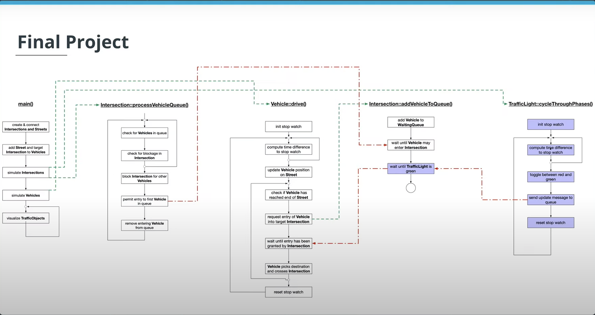

# Concurrent Traffic Simulation #

## Overview ##

Throughout the Concurrency course, you have been developing a traffic simulation in which vehicles are moving along streets and are crossing intersections. However, with increasing traffic in the city, traffic lights are needed for road safety. Each intersection will therefore be equipped with a traffic light. In this project, you will build a suitable and thread-safe communication protocol between vehicles and intersections to complete the simulation. Use your knowledge of concurrent programming (such as mutexes, locks and message queues) to implement the traffic lights and integrate them properly in the code base.

## Dependencies ##

- Cmake
- OpenCV >= 4.1 install by "*sudo apt instal libopencv-dev*"

## How project works ##

