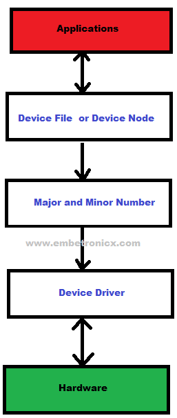
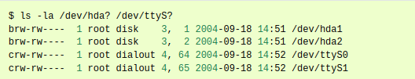
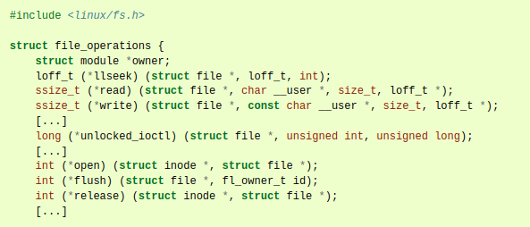

# Device Driver #

A device driver is a piece of kernel code that allows the operating system (Linux) to talk to hardware.
It acts like a translator between:

- Hardware (physical device) 🔌
- Software (Linux kernel and user apps) 🖥️

Without drivers, the OS can't understand how to use the hardware!

## Types of Linux Device Drivers ##

| Type                            | Example                       |
|---------------------------------|-------------------------------|
| Character Device Driver Serial  | ports (/dev/ttyS0), sensors   |
| Block Device Driver Hard drives | (/dev/sda)                    |
| Network Device Driver           | Ethernet cards, WiFi adapters |
| USB Driver                      | USB mouse, USB storage        |
| Platform Driver                 | Embedded devices (ARM boards) |
| PCI Driver                      | PCI cards inside the system   |

## How application (user space) communicate with hardware via device driver ##

In UNIX, hardware devices are accessed by the user through special device files. These files are grouped into the **/dev** directory.

System calls open, read, write, close, lseek, mmap etc. are redirected by the operating system to the device driver associated with the physical device.



- Initially, the Application will open the device file. This device file is created by the device driver.
- Then this device file will find the corresponding device driver using major and minor numbers.
- Then that Device driver will talk to the Hardware device.

**Note:** If your device driver needs to communicate with hardware (peripheral such as: UART, SPI, I2C), you need to define an device-tree overlay file.

### Major and Minor number ###

The Linux kernel represents character and block devices as pairs of numbers **major** and **minor**.

- *Major number*: Traditionally, the major number identifies the driver associated with the device. A major number can also be shared by multiple device.

- *Minor number*: The major number is to identify the corresponding driver. Many devices may use the same major number. So we need to assign the number to each device that is using the same major number. So, this is a minor number. In other words, The device driver uses the minor number to distinguish individual physical or logical devices.

  

### Create device file ###

You can create device file by using command:

```c
mknod -m <permissions> <name> <device type> <major> <minor>
```

- permissions – optional argument that sets the permission bits of the new device file to permissions
- *name* – Your device file name that should have a full path (/dev/name)
- *device type* – Put c or b
  - c – Character Device
  - b – Block Device

- *major* – major number of your driver

- *minor* – minor number of your driver

### Implement operation for a device ###

As mentioned above, the character device drivers receive unaltered system calls made by users over device-type files. Consequently, implementation of a character device driver means implementing the system calls specific to files: open, close, read, write, lseek, mmap, etc. These operations are described in the fields of the struct file_operations structure:



### Registration and unregistration of device ###

Static allocation and deallocation of a device can be performed by using 

```c
#include <linux/fs.h>

int register_chrdev_region(dev_t first, unsigned int count, char *name);
void unregister_chrdev_region(dev_t first, unsigned int count);
```

## Device tree ##

- Convert **<.dtb>** into **<.dts>** file:

  ```c
  dtc -I dtb -O dts -o output.dts input.dtb
  ```

- Compile **<.dts>** into **<.dtb>** file:

  ```c
  dtc -@ -I dts -O dtb -o name.dtbo name.dts
  ```
