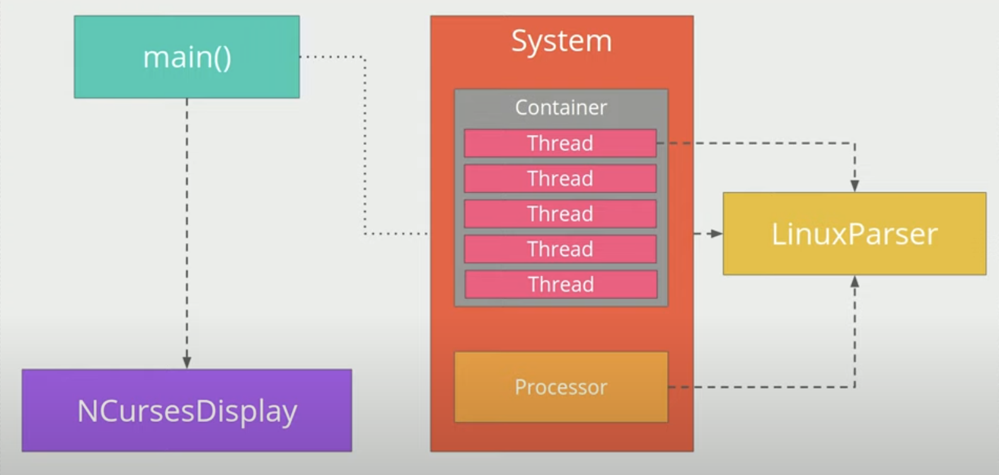

# CppND-System-Monitor #

## Purpose ##

This project is a simulation a the HTOP application which is a process, CPU and memory monitor in linux.

## Dependencies ##

- Cmake
- Ncurse TUI library install by: *sudo apt install libncurses5-dev libncursesw5-dev*

## How the project works ##

